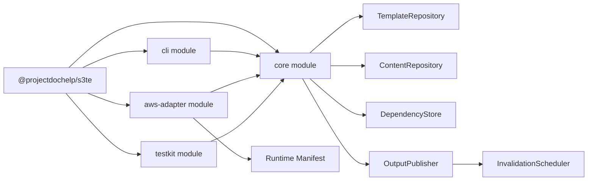
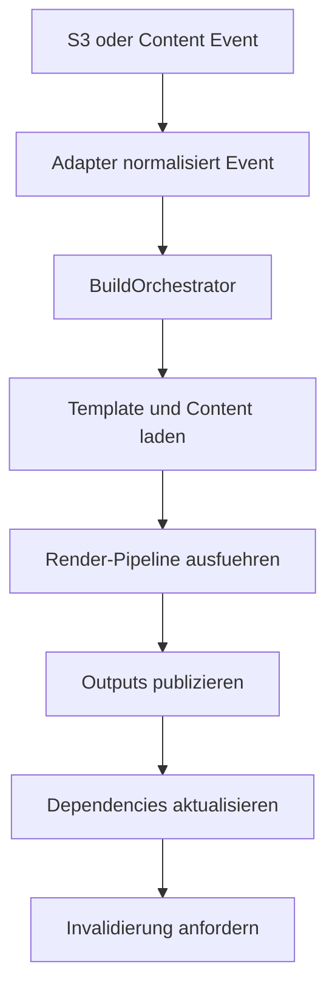

# S3TemplateEngine Rewrite - Zielarchitektur

## Ziel

Die Zielarchitektur trennt S3TE in einen plattformneutralen Render-Core und austauschbare Adapter fuer AWS, CLI und Tests. Die Anwendung soll anhand dieser Dokumentation neu implementierbar sein, ohne Kenntnis des monolithischen Legacy-Codes.

## Architekturprinzipien

1. Core und AWS bleiben strikt getrennt.
2. dieselbe Renderlogik wird lokal, im Test und in AWS verwendet.
3. Nutzer konfigurieren nur Projektstruktur und Inhalte, nicht Lambda-Details.
4. ein Environment-Deploy ist fuer Noob-Nutzer genau ein CLI-Schritt.
5. der Core kennt weder S3 noch DynamoDB noch CloudFront.

## Repository-Struktur

```text
repo/
  docs/
  packages/
    core/
    aws-adapter/
    cli/
    testkit/
  schemas/
```

Die Ordner unter `packages/` sind interne Modulgrenzen. Veroeffentlicht wird nur das Root-Paket `@projectdochelp/s3te`.

## Komponenten



### `core` Modul

Verantwortung:

- Template-Sprache gemaess [template-language.md](./template-language.md)
- Render-Kontext und Build-Orchestrierung
- Dependency-Erfassung
- deterministische Ergebnisbildung

### `aws-adapter` Modul

Verantwortung:

- AWS Event-Normalisierung
- S3-, DynamoDB-, SSM-, CloudFront- und Route53-Zugriffe
- Runtime-Manifest lesen
- Webiny-Mirror
- CloudFormation-Deploy-Unterstuetzung

### `cli` Modul

Verantwortung:

- Projektinitialisierung
- Validierung
- lokales Rendering
- Tests
- Packaging
- Deploy
- Diagnose und Migration

### `testkit` Modul

Verantwortung:

- In-Memory-Implementierungen der Core-Interfaces
- Snapshot- und Strukturtests
- Accessibility-Helfer
- Mocks fuer Content- und AWS-nahe Abstraktionen

## Laufzeitfluesse



### Lokaler Render-Lauf

1. CLI liest `s3te.config.json`
2. CLI validiert und wendet Defaults an
3. CLI baut `ResolvedProjectConfig`
4. CLI verwendet In-Memory- oder Dateisystem-Adapter
5. Core rendert in `offline/S3TELocal/preview/...`

### AWS-Render-Lauf

1. S3 oder Content-Quelle erzeugt ein AWS Event
2. AWS-Adapter normalisiert das Event
3. `render-worker` laedt Runtime-Manifest und Dependencies
4. Core rendert die betroffenen Ziele
5. AWS-Adapter publiziert Outputs und Invalidierungen

## Render-Pipeline

Die Pipeline ist vertraglich fest und gilt fuer lokal, Tests und AWS gleich:

1. Template laden
2. `dbmultifile`-Kontrollblock am Template-Start pruefen
3. `if` auswerten
4. `fileattribute` auswerten
5. `part`, `dbpart`, `dbmulti`, `dbitem` rekursiv aufloesen
6. `lang` und `switchlang` auswerten
7. `dbmultifileitem` auswerten
8. HTML minifizieren
9. Artefakt, Dependencies und Warnungen zurueckgeben

## Persistenz

Der Rewrite benoetigt drei logische Speicher:

1. `ContentStore`
2. `DependencyStore`
3. `InvalidationStore`

Die erste Referenzimplementierung verwendet DynamoDB. Das konkrete Schema ist in [data-model.md](./data-model.md) beschrieben.

## Projektstruktur fuer Nutzer

Die Default-Projektstruktur lautet:

```text
project/
  s3te.config.json
  app/
    part/
    website/
  offline/
    content/
    schemas/
    tests/
  .vscode/
```

Assets liegen standardmaessig innerhalb der Variantenordner, nicht in einem separaten globalen `public/`-Ordner.

## Implementierungsphasen

### Phase 1

- `core` Modul
- `testkit` Modul
- `cli` Modul mit `init`, `validate`, `render`, `test`

### Phase 2

- `aws-adapter` Modul
- Packaging und Deploy
- Dependency Store
- Invalidation Store

### Phase 3

- Webiny Mirror
- Sitemap-Adapter
- `doctor` und `migrate`

## Dokumentenlandkarte

Architektur allein reicht nicht. Die Implementierung muss diese Dokumente gemeinsam verwenden:

- [requirements.md](./requirements.md)
- [configuration.md](./configuration.md)
- [configuration-schema.md](./configuration-schema.md)
- [template-language.md](./template-language.md)
- [interfaces.md](./interfaces.md)
- [cli-contract.md](./cli-contract.md)
- [data-model.md](./data-model.md)
- [aws-runtime.md](./aws-runtime.md)
- [technical-baseline.md](./technical-baseline.md)

## Bewusste Architekturentscheidungen

### AD-001 Ein Environment-Stack plus transienter Deploy-Stack

Der Rewrite verwendet genau einen persistenten CloudFormation-Stack pro Umgebung und fuer echte Deploy-Laeufe zusaetzlich genau einen kurzen temporaeren Packaging-Stack. Das reduziert Noob-Komplexitaet massiv gegenueber dem Legacy-Aufbau mit Zusatz-Templates und haelt trotzdem alle von `deploy` angelegten AWS-Ressourcen innerhalb von CloudFormation.

### AD-002 Runtime-Manifest ausserhalb der Projektkonfiguration

Bucket-, Alias- und Distribution-Informationen fuer den AWS-Betrieb werden als Runtime-Manifest gehalten. Nutzer pflegen weiterhin nur `s3te.config.json`.

### AD-003 Stringbasierter Template-Core

V1 verwendet keinen HTML-AST. Das reduziert Abhaengigkeiten und bleibt nah genug am bisherigen Verhalten.

### AD-004 Direkte Asset-Kopie im Dispatcher

Nicht renderbare Dateien werden im `source-dispatcher` kopiert oder geloescht. Dadurch bleibt der `render-worker` auf echte Template-Arbeit fokussiert.
