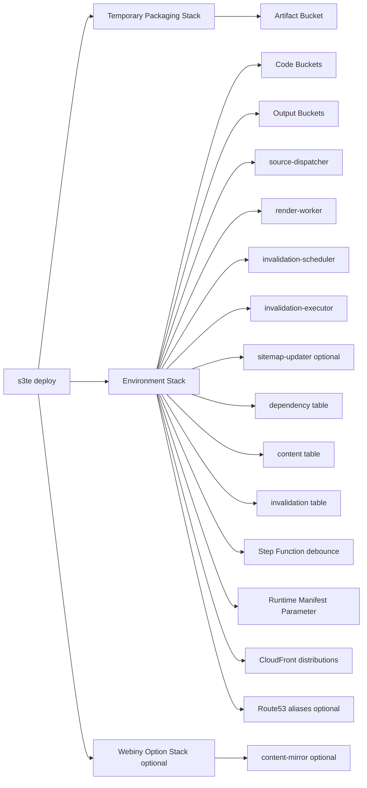
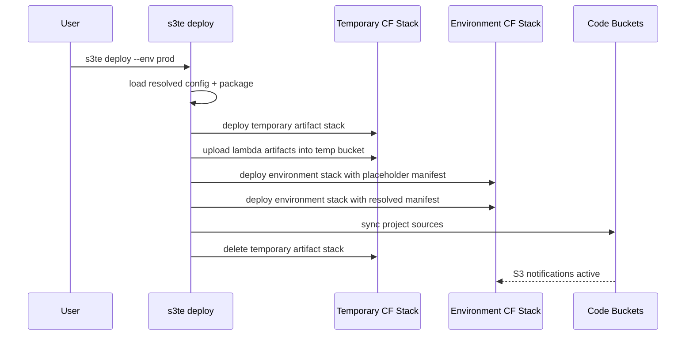
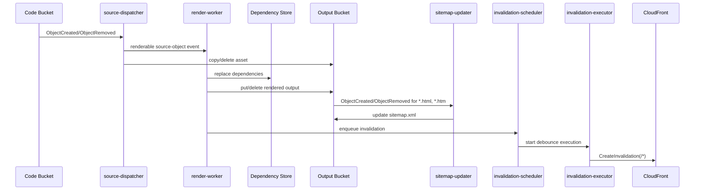

# S3TemplateEngine Rewrite - AWS Runtime

## Ziel

Dieses Dokument beschreibt die konkrete AWS-Referenzimplementierung fuer V1. Es ist die normative Spezifikation fuer:

- CloudFormation-Ressourcen
- Event-Fluesse
- Lambda-Verantwortungen
- Runtime-Konfiguration
- AWS-Berechtigungen

Der Core bleibt AWS-frei. Alles in diesem Dokument gehoert ausschliesslich in den AWS-Adapter und den Deploy-Teil der CLI.

## V1-Topologie

V1 verwendet:

- genau einen persistenten Haupt-CloudFormation-Stack pro Umgebung
- optional weitere persistente Option-Stacks pro Umgebung, wenn Zusatzteile wie Webiny aktiviert sind
- genau einen temporaeren CloudFormation-Stack waehrend eines echten Deploy-Laufs fuer Packaging-Artefakte

Der temporaere Stack wird nach erfolgreichem oder fehlgeschlagenem Deploy wieder geloescht. Nur bei `--plan` bleibt er bestehen, solange das Change Set auf seine Artefakte verweist.

Stack-Name:

- `<stackPrefix>-s3te-<project>`

Beispiel:

- `DEV-s3te-mywebsite`

Temporärer Stack-Name:

- `<stackPrefix>-s3te-<project>-deploy-temp`

Das ist eine bewusste Vereinfachung gegenueber dem Legacy-Repo, das Basis-, Sprach-, Varianten- und Webiny-Teile in mehrere Templates aufgeteilt hat.

## Ressourcen pro Umgebung

### S3

- ein Code-Bucket pro Variante
- ein Output-Bucket pro Variante und Sprache

### Lambda

- `source-dispatcher`
- `render-worker`
- `invalidation-scheduler`
- `invalidation-executor`
- optional `sitemap-updater`
- optional `content-mirror` in einem separaten Webiny-Options-Stack

### DynamoDB

- Dependency Store
- Content Store
- Invalidation Store

### Weitere AWS-Dienste

- eine Step Function fuer das Invalidation-Debounce
- ein SSM Parameter fuer das Runtime-Manifest
- eine CloudFront Distribution pro Variante und Sprache
- optionale Route53 Alias-Records pro Distribution

### Temporaere Deploy-Ressourcen

- ein temporaerer Artefakt-Bucket in einem eigenen CloudFormation-Stack

Diese Ressource dient nur dazu, Lambda-ZIPs waehrend des Deploys CloudFormation-konform bereitzustellen.

## Webiny nachruesten

Die V1-Topologie ist absichtlich so aufgebaut, dass Webiny spaeter nachgeruestet werden kann.

Zielbild fuer die optionale CMS-Integration ist Webiny 6.x in einer Standard-AWS-Installation.

Ausgangslage:

- der persistente Environment-Stack existiert bereits ohne Webiny
- die S3TE-Content-Tabelle existiert bereits ohne Webiny

Beim spaeteren Aktivieren von `integrations.webiny.enabled = true` und einem erneuten `deploy`:

1. bleibt der bestehende Environment-Stack erhalten
2. wird ein zusaetzlicher Webiny-Options-Stack fuer `content-mirror` und `ContentMirrorEventSourceMapping` deployed
3. bleibt der interne Content Store derselbe
4. muessen keine Buckets, Distributionen oder Tabellen neu benannt werden

## Sitemap nachruesten

Die V1-Topologie erlaubt auch das spaetere Aktivieren von `integrations.sitemap.enabled = true`.

Beim anschliessenden `deploy`:

1. bleibt der bestehende Environment-Stack erhalten
2. wird `sitemap-updater` in denselben Stack aufgenommen
3. bekommen die Output-Buckets HTML-basierte S3-Notifications auf diese Lambda
4. schreibt S3TE danach automatisch eine `sitemap.xml` pro Output-Bucket

## Runtime-Manifest

Die AWS-Referenzimplementierung haelt ein aufgeloestes Runtime-Manifest in SSM Parameter Store.

Parameter-Name:

- `/<stackPrefix>/s3te/<project>/runtime-manifest`

Beispiel:

- `/DEV/s3te/mywebsite/runtime-manifest`

Inhalt:

- Bucket-Namen
- Distribution IDs
- Aliases
- Base URLs
- Varianten- und Sprachmatrix

Die Lambdas lesen dieses Manifest bei Cold Start. Dadurch braucht der Render- und Invalidation-Pfad keine Alias-zu-Distribution-Suche waehrend des normalen Betriebs.

Wichtig:

- der SSM-Parameter selbst ist Teil des Environment-Stacks
- der Parameterwert wird nicht ausserhalb von CloudFormation mutiert
- stattdessen fuehrt `deploy` nach dem ersten Stack-Lauf einen zweiten Stack-Update mit dem aufgeloesten Manifest als Parameter durch

## Deploy-Fluss

## Lambda-Umgebungsvertraege

### `source-dispatcher`

Pflicht-Umgebungsvariablen:

- `S3TE_ENVIRONMENT`
- `S3TE_RUNTIME_PARAMETER`
- `S3TE_RENDER_WORKER_NAME`
- `S3TE_RENDER_EXTENSIONS`

Verantwortung:

1. S3 Events aus Code-Buckets empfangen
2. Variante zum Bucket bestimmen
3. renderbare von nicht renderbaren Dateien unterscheiden
4. Assets direkt in alle Ziel-Buckets der Variante kopieren oder loeschen
5. fuer renderbare Dateien den `render-worker` asynchron mit `NormalizedBuildEvent` aufrufen

### `render-worker`

Pflicht-Umgebungsvariablen:

- `S3TE_ENVIRONMENT`
- `S3TE_RUNTIME_PARAMETER`
- `S3TE_DEPENDENCY_TABLE`
- `S3TE_CONTENT_TABLE`
- `S3TE_INVALIDATION_SCHEDULER_NAME`

Verantwortung:

1. Runtime-Manifest laden
2. `NormalizedBuildEvent` in `BuildRequest` uebersetzen
3. renderbare Quellen ueber den Core verarbeiten
4. Output schreiben oder loeschen
5. Dependencies aktualisieren
6. Invalidation anfordern

### `invalidation-scheduler`

Pflicht-Umgebungsvariablen:

- `S3TE_ENVIRONMENT`
- `S3TE_INVALIDATION_TABLE`
- `S3TE_DEBOUNCE_SECONDS`
- `S3TE_INVALIDATION_STATE_MACHINE_ARN`

Verantwortung:

1. Invalidierungsanfrage persistieren
2. pro Distribution genau ein Debounce-Fenster oeffnen
3. Step Function nur einmal pro offenem Fenster starten

### `invalidation-executor`

Pflicht-Umgebungsvariablen:

- `S3TE_ENVIRONMENT`
- `S3TE_INVALIDATION_TABLE`

Verantwortung:

1. alle offenen Requests fuer eine Distribution laden
2. gebuendelt genau eine CloudFront-Invalidierung `/*` ausfuehren
3. Requests und Fenstersperre entfernen

### `content-mirror`

Pflicht-Umgebungsvariablen:

- `S3TE_ENVIRONMENT`
- `S3TE_CONTENT_TABLE`
- `S3TE_RELEVANT_MODELS`
- `S3TE_WEBINY_TENANT`
- `S3TE_RENDER_WORKER_NAME`

Verantwortung:

1. Webiny-6-DynamoDB-Stream lesen
2. Inhalte tenant- und locale-bewusst normalisieren
3. Content Store updaten
4. den `render-worker` mit `content-item`-Events asynchron anstossen

### `sitemap-updater`

Pflicht-Umgebungsvariablen:

- `S3TE_ENVIRONMENT`
- `S3TE_RUNTIME_PARAMETER`

Verantwortung:

1. S3-Events aus Output-Buckets fuer HTML-Dateien empfangen
2. Bucket auf Variante und Sprache zurueckabbilden
3. `sitemap.xml` laden oder leer initialisieren
4. `index.html` und `<dir>/index.html` in saubere kanonische URLs umschreiben
5. `404.html` ignorieren
6. `sitemap.xml` im betroffenen Output-Bucket aktualisieren

## Event-Fluesse

### 1. Source-Events

Trigger:

- `ObjectCreated:*`
- `ObjectRemoved:*`

Quelle:

- jeder Code-Bucket der Umgebung

Pflichtverhalten:

1. Bucket auf Variante abbilden
2. Dateiendung gegen `renderExtensions` pruefen
3. fuer renderbare Dateien `render-worker` asynchron aufrufen
4. fuer nicht renderbare Dateien direkte S3 Copy/Delete-Operationen in allen Ziel-Buckets der Variante ausfuehren

### 2. Content-Events

Trigger:

- optionaler Webiny DynamoDB Stream

Pflichtverhalten:

1. nur publizierte Webiny-Revisionen spiegeln
2. `staticContent` und `staticCodeContent` immer unterstuetzen
3. zusaetzliche `relevantModels` aus der Projektkonfiguration ebenfalls unterstuetzen
4. bei gesetztem `tenant` nur diesen Tenant spiegeln
5. lokalisierte Eintraege ueber `webinyLocale` bzw. Sprach-Praefix-Matching aufloesen
6. nach Upsert oder Delete den `render-worker` mit `content-item`-Event anstossen

### 3. Invalidation-Events

Trigger:

- erfolgreiche Render-Publikation oder geloeschte Outputs

Pflichtverhalten:

1. pro Distribution eine Anfrage in den Invalidation Store schreiben
2. Requests innerhalb des Debounce-Fensters zusammenfassen
3. in V1 immer `/*` invalidieren

### 4. Sitemap-Events

Trigger:

- `ObjectCreated:*`
- `ObjectRemoved:*`

Quelle:

- jeder Output-Bucket der Umgebung, gefiltert auf `*.html` und `*.htm`

Pflichtverhalten:

1. `404.html` ignorieren
2. `index.html` als `/` und `<dir>/index.html` als `<dir>/` schreiben
3. auf normale Seiten wie `about.html` den Dateinamen in der URL belassen
4. `sitemap.xml` im selben Output-Bucket aktualisieren

## CloudFormation-Outputs

Der Environment-Stack muss mindestens diese Outputs erzeugen:

- Stack-Name
- Runtime-Manifest-Parametername
- Code-Bucket pro Variante
- Output-Bucket pro Variante und Sprache
- Distribution ID pro Variante und Sprache
- Distribution Domain Name pro Variante und Sprache
- Namen der drei DynamoDB-Tabellen
- Lambda-Funktionsnamen

Der temporaere Deploy-Stack muss mindestens diese Outputs erzeugen:

- Artefakt-Bucket-Name

## DNS und Zertifikate

Pflichtregeln:

1. jede Umgebung benoetigt ein ACM-Zertifikat in `us-east-1`
2. `cloudFrontAliases` werden bei der Distribution hinterlegt
3. wenn ein `prod`-Environment existiert, werden nicht-produktive Aliase aus der Konfiguration abgeleitet:
   `example.com` -> `test.example.com`, `app.example.com` -> `test-app.example.com`
4. wenn `route53HostedZoneId` gesetzt ist, legt `deploy` A- und AAAA-Alias-Records an
5. wenn `route53HostedZoneId` fehlt, bleibt DNS ein manueller Schritt

## Namenskonventionen

### Buckets

- Code-Bucket Default: `<envPrefix><variant>-code-<project>`
- Output-Bucket Default:
  - Default-Sprache oder Einsprach-Projekt: `<envPrefix><variant>-<project>`
  - sonst: `<envPrefix><variant>-<project>-<lang>`

### Lambda-Funktionen

- `<STACKPREFIX>_s3te_source_dispatcher`
- `<STACKPREFIX>_s3te_render_worker`
- `<STACKPREFIX>_s3te_invalidation_scheduler`
- `<STACKPREFIX>_s3te_invalidation_executor`
- `<STACKPREFIX>_s3te_sitemap_updater`
- `<STACKPREFIX>_s3te_content_mirror`

### Step Function

- `<STACKPREFIX>_s3te_invalidation`

### SSM Parameter

- `/<stackPrefix>/s3te/<project>/runtime-manifest`

## IAM-Berechtigungen

Die Referenzimplementierung soll Least Privilege verwenden. Die folgenden Berechtigungen sind die Zielmenge, nicht Full Access.

### `source-dispatcher`

- `ssm:GetParameter`
- `s3:GetObject`
- `s3:PutObject`
- `s3:DeleteObject`
- `lambda:InvokeFunction` auf `render-worker`

### `render-worker`

- `ssm:GetParameter`
- `s3:GetObject`
- `s3:PutObject`
- `s3:DeleteObject`
- `dynamodb:Query`
- `dynamodb:Scan`
- `dynamodb:PutItem`
- `dynamodb:DeleteItem`
- `lambda:InvokeFunction` auf `invalidation-scheduler`

### `invalidation-scheduler`

- `dynamodb:PutItem`
- `dynamodb:UpdateItem`
- `states:StartExecution`

### `invalidation-executor`

- `dynamodb:Query`
- `dynamodb:DeleteItem`
- `cloudfront:CreateInvalidation`

### `content-mirror`

- `dynamodb:GetRecords`
- `dynamodb:GetShardIterator`
- `dynamodb:DescribeStream`
- `dynamodb:PutItem`
- `dynamodb:DeleteItem`
- `lambda:InvokeFunction` auf `render-worker`

### `sitemap-updater`

- `ssm:GetParameter`
- `s3:GetObject`
- `s3:PutObject`

### `deploy`-Pfad der CLI

- `cloudformation:*` auf den Environment-Stack
- `cloudformation:*` auf den Webiny-Options-Stack, falls Webiny aktiviert ist
- `cloudformation:*` auf den temporaeren Deploy-Stack
- `iam:PassRole` fuer die erzeugten Lambda-Rollen
- `s3:*` auf die von S3TE verwalteten Buckets
- `ssm:GetParameter` auf das Runtime-Manifest im Laufzeitpfad
- `route53:ChangeResourceRecordSets` auf die konfigurierte Hosted Zone, falls Auto-DNS aktiv

## Feature-Schalter

### `webiny`

Aktiviert:

- `content-mirror`
- Event Source Mapping auf den Quell-Stream
- separaten Webiny-Options-Stack fuer diese Ressourcen

### `sitemap`

Aktiviert:

- `sitemap-updater`
- S3-Notifications von allen Output-Buckets auf `*.html` und `*.htm`

## Bewusste Abweichungen zum Legacy-Repo

1. ein persistenter Stack pro Umgebung plus ein kurzer temporaerer Packaging-Stack statt mehrerer Zusatz-Templates
2. kein Laufzeit-Lookup der Distribution ueber Alias notwendig, weil die Distribution ID im Runtime-Manifest liegt
3. direkte Asset-Kopie im `source-dispatcher`, statt einen Render-Lambda fuer alles zu missbrauchen
