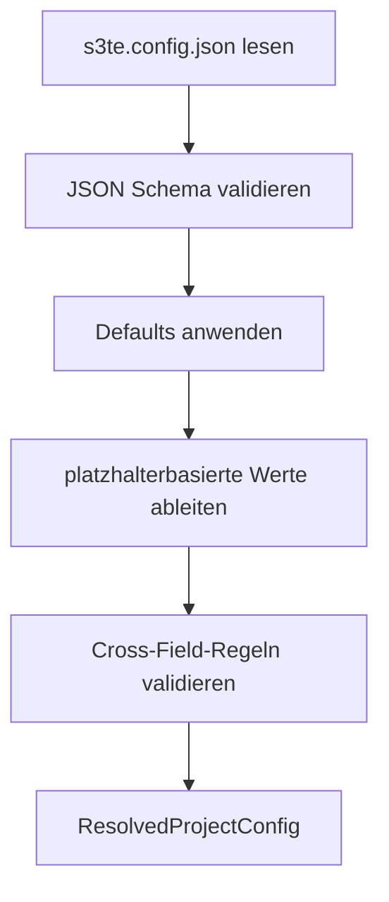

# S3TemplateEngine Rewrite - Konfiguration

## Ziel

`s3te.config.json` ist die einzige kanonische Projektkonfiguration. Sie beschreibt Projektname, Umgebungen, Varianten, Sprachen, Rendering-Regeln, AWS-Ressourcen und optionale Integrationen.

Diese Datei ist:

- Eingabe fuer `s3te init`, `validate`, `render`, `package`, `deploy` und `migrate`
- die einzige Nutzer-konfigurierbare Laufzeitquelle fuer Varianten und Sprachen
- strikt validiert, bevor Rendering oder Deployment startet

Das maschinenlesbare Strukturschema liegt in [configuration-schema.md](./configuration-schema.md) und in `schemas/s3te.config.schema.json`. Das durch `s3te init` in Nutzerprojekten abgelegte Exemplar liegt standardmaessig unter `offline/schemas/s3te.config.schema.json`.



## Grundregeln

1. Die Datei heisst immer `s3te.config.json`.
2. Das Format ist UTF-8 JSON ohne Kommentare und ohne Trailing Commas.
3. Unbekannte Properties sind ungueltig.
4. Alle Pfade in der Konfiguration sind relativ zum Projekt-Root.
5. Defaults werden vor Cross-Field-Validierung angewendet.
6. Ableitungen aus dem Umgebungsnamen oder Variantennamen sind deterministisch und dokumentiert.

## Normalisierungsreihenfolge

Die Zielimplementierung muss die Konfiguration in dieser Reihenfolge aufbereiten:

1. JSON parsen.
2. JSON Schema validieren.
3. statische Defaults anwenden
4. abgeleitete Defaults anwenden, die vom Schluessel abhangen
5. Platzhalter aufloesen
6. Cross-Field-Regeln validieren
7. `ResolvedProjectConfig` an Core und Adapter uebergeben

## Kanonisches Beispiel

```json
{
  "$schema": "./offline/schemas/s3te.config.schema.json",
  "configVersion": 1,
  "project": {
    "name": "mywebsite"
  },
  "environments": {
    "dev": {
      "awsRegion": "eu-central-1",
      "stackPrefix": "DEV",
      "certificateArn": "arn:aws:acm:us-east-1:123456789012:certificate/aaaa-bbbb",
      "route53HostedZoneId": "Z1234567890"
    },
    "prod": {
      "awsRegion": "eu-central-1",
      "stackPrefix": "PROD",
      "certificateArn": "arn:aws:acm:us-east-1:123456789012:certificate/eeee-ffff",
      "route53HostedZoneId": "Z1234567890"
    }
  },
  "rendering": {
    "minifyHtml": true,
    "renderExtensions": [".html", ".htm", ".part"],
    "outputDir": "offline/S3TELocal/preview",
    "maxRenderDepth": 50
  },
  "variants": {
    "website": {
      "sourceDir": "app/website",
      "partDir": "app/part",
      "defaultLanguage": "en",
      "routing": {
        "indexDocument": "index.html",
        "notFoundDocument": "404.html"
      },
      "languages": {
        "en": {
          "baseUrl": "example.com",
          "targetBucket": "{envPrefix}website-{project}",
          "cloudFrontAliases": ["example.com", "www.example.com"],
          "webinyLocale": "en-US"
        },
        "de": {
          "baseUrl": "example.de",
          "targetBucket": "{envPrefix}website-{project}-de",
          "cloudFrontAliases": ["example.de", "www.example.de"],
          "webinyLocale": "de-DE"
        }
      }
    },
    "app": {
      "sourceDir": "app/app",
      "partDir": "app/part",
      "defaultLanguage": "en",
      "languages": {
        "en": {
          "baseUrl": "app.example.com",
          "targetBucket": "{envPrefix}app-{project}",
          "cloudFrontAliases": ["app.example.com"]
        }
      }
    }
  },
  "aws": {
    "codeBuckets": {
      "website": "{envPrefix}website-code-{project}",
      "app": "{envPrefix}app-code-{project}"
    },
    "dependencyStore": {
      "tableName": "{stackPrefix}_s3te_dependencies_{project}"
    },
    "contentStore": {
      "tableName": "{stackPrefix}_s3te_content_{project}",
      "contentIdIndexName": "contentid"
    },
    "invalidationStore": {
      "tableName": "{stackPrefix}_s3te_invalidations_{project}",
      "debounceSeconds": 60
    },
    "lambda": {
      "runtime": "nodejs22.x",
      "architecture": "arm64"
    }
  },
  "integrations": {
    "sitemap": {
      "enabled": true,
      "environments": {
        "dev": {
          "enabled": false
        }
      }
    },
    "webiny": {
      "enabled": false,
      "sourceTableName": "webiny-1234567",
      "mirrorTableName": "{stackPrefix}_s3te_content_{project}",
      "tenant": "root",
      "relevantModels": ["staticContent", "staticCodeContent", "article"],
      "environments": {
        "test": {
          "sourceTableName": "webiny-test-1234567",
          "tenant": "preview"
        },
        "prod": {
          "sourceTableName": "webiny-live-1234567",
          "tenant": "root"
        }
      }
    }
  }
}
```

## Root-Properties

### `$schema`

- optional
- Standardwert: `"./offline/schemas/s3te.config.schema.json"`
- nur fuer Editor- und Tooling-Unterstuetzung

### `configVersion`

- optional
- Standardwert: `1`
- steuert spaetere Migrationen ueber `s3te migrate`

### `project`

Pflichtblock mit:

- `name`: Pflicht, lowercase alnum plus Bindestrich, Regex `^[a-z0-9-]+$`

Optionale Felder:

- `displayName`: optional, frei fuer README- und Scaffold-Texte

### `environments`

Pflichtblock. Jeder Key ist ein logischer Umgebungsname wie `dev`, `stage`, `prod`.

Pflichtfelder pro Umgebung:

- `awsRegion`
- `certificateArn`

Optionale Felder pro Umgebung:

- `stackPrefix`
- `route53HostedZoneId`

Defaults:

- `stackPrefix`: uppercased Umgebungsname, Bindestriche werden zu `_`

Beispiele:

- `dev` -> `DEV`
- `stage-eu` -> `STAGE_EU`

Hinweis zu `certificateArn`:

- das Zertifikat muss in `us-east-1` liegen
- es muss alle finalen CloudFront-Aliase des Environments abdecken
- `*.example.com` deckt `test.example.com` und `test-app.example.com` ab
- `*.example.com` deckt nicht `test-admin.app.example.com` ab
- fuer tiefere Hosts wie `test-admin.app.example.com` braucht man zum Beispiel `*.app.example.com`, den exakten Hostnamen oder ein separates Zertifikat pro Environment

### `rendering`

Optionaler Block.

Defaults:

- `minifyHtml`: `true`
- `renderExtensions`: `[".html", ".htm", ".part"]`
- `outputDir`: `"offline/S3TELocal/preview"`
- `maxRenderDepth`: `50`

Fest verdrahtete, nicht konfigurierbare Regel:

- fehlende Partials, Sprachinhalte und Content-Referenzen werden immer als leerer String gerendert und als Warnung protokolliert

### `variants`

Pflichtblock. Jeder Key ist ein Variantenname wie `website`, `app` oder `admin`.

Pflichtfelder pro Variante:

- `defaultLanguage`
- `languages`

Optionale Felder pro Variante:

- `sourceDir`
- `partDir`
- `routing`

Defaults:

- `sourceDir`: `app/<variant>`
- `partDir`: `app/part`
- `routing.indexDocument`: `index.html`
- `routing.notFoundDocument`: `404.html`

### `aws`

Optionaler Block mit AWS-Adapter-Details. Fehlt der Block, muessen alle hier genannten Defaults angewendet werden.

Defaults:

- `codeBuckets.<variant>`: `{envPrefix}{variant}-code-{project}`
- `dependencyStore.tableName`: `{stackPrefix}_s3te_dependencies_{project}`
- `contentStore.tableName`: `{stackPrefix}_s3te_content_{project}`
- `contentStore.contentIdIndexName`: `contentid`
- `invalidationStore.tableName`: `{stackPrefix}_s3te_invalidations_{project}`
- `invalidationStore.debounceSeconds`: `60`
- `lambda.runtime`: `nodejs22.x`
- `lambda.architecture`: `arm64`

### `integrations`

Optionaler Block.

`integrations.sitemap` Defaults:

- `enabled`: `false`
- `environments.<env>`: kein Override

Wenn Sitemap fuer ein Environment effektiv `enabled = true` ist, pflegt S3TE nach dem Deploy automatisch eine `sitemap.xml` pro Output-Bucket dieses Environments.

`integrations.sitemap.environments.<env>` darf nur `enabled` enthalten und ueberschreibt den globalen Sitemap-Schalter nur fuer dieses eine Environment.

Das Sitemap-Feature arbeitet auf den Output-Buckets:

- HTML-Upserts und -Deletes aktualisieren `sitemap.xml`
- `404.html` wird ignoriert
- `index.html` und `<dir>/index.html` werden als saubere Verzeichnis-URLs geschrieben
- nicht-HTML Assets bleiben ausserhalb der Sitemap

`integrations.webiny` Defaults:

- `enabled`: `false`
- `mirrorTableName`: `{stackPrefix}_s3te_content_{project}`
- `relevantModels`: `["staticContent", "staticCodeContent"]`
- `tenant`: nicht gesetzt
- `environments.<env>`: kein Override

Wenn Webiny fuer ein Environment effektiv `enabled = true` ist, ist fuer dieses Environment `sourceTableName` Pflicht. Das kann global oder ueber `integrations.webiny.environments.<env>` geliefert werden.

`integrations.webiny.environments.<env>` darf dieselben Felder wie `integrations.webiny` enthalten und ueberschreibt die globalen Webiny-Werte nur fuer dieses eine Environment.

Fuer Webiny 6.x gilt zusaetzlich:

- S3TE spiegelt nur publizierte Inhalte
- S3TE kann auf einen einzelnen Webiny-Tenant eingeschraenkt werden
- S3TE matcht lokalisierte Inhalte ueber `webinyLocale`
- die Referenzimplementierung setzt eine Standard-Webiny-AWS-Installation mit DynamoDB-basiertem Content-Store voraus

Webiny darf bewusst spaeter nachgeruestet werden:

1. S3TE zuerst ohne Webiny deployen
2. spaeter Webiny separat installieren
3. danach `integrations.webiny` aktivieren
4. anschliessend denselben Environment-Stack erneut deployen

Die Content-Tabelle des S3TE-Stacks existiert in V1 immer. Das Nachruesten von Webiny fuegt daher nur die Spiegelungs-Ressourcen und deren Event-Anbindung hinzu; es erfordert keinen kompletten Neuaufbau des Projekts.

## Sprachdefinition

Jede Sprache unter `variants.<variant>.languages` besitzt:

- `baseUrl`: Pflicht, als Hostname ohne Protokoll oder Pfad
- `targetBucket`: optional, Default siehe unten
- `cloudFrontAliases`: Pflicht, mindestens ein Alias als Hostname ohne Protokoll oder Pfad
- `webinyLocale`: optional, fuer Webiny 6.x die zugehoerige Webiny-Locale wie `en-US`

Wenn das Projekt ein Environment `prod` besitzt, werden `baseUrl` und `cloudFrontAliases` als produktive Basiswerte interpretiert:

1. fuer `prod` bleiben sie unveraendert
2. bei Apex-Hosts mit genau zwei Labels wird fuer alle anderen Environments `<env>.` davor gesetzt
3. bei Hosts mit mindestens einer Subdomain wird fuer alle anderen Environments `<env>-` an das linke erste Label angehaengt

Beispiele:

- `schwimmbad-oberprechtal.de` wird in `test` zu `test.schwimmbad-oberprechtal.de`
- `app.schwimmbad-oberprechtal.de` wird in `test` zu `test-app.schwimmbad-oberprechtal.de`
- `admin.app.schwimmbad-oberprechtal.de` wird in `test` zu `test-admin.app.schwimmbad-oberprechtal.de`

Wichtig fuer ACM:

- das Zertifikat des gewaehlten Environments muss diese abgeleiteten Aliase ebenfalls abdecken
- ein einzelnes Wildcard-Zertifikat fuer `*.schwimmbad-oberprechtal.de` deckt `test.schwimmbad-oberprechtal.de` und `test-app.schwimmbad-oberprechtal.de` ab
- fuer `test-admin.app.schwimmbad-oberprechtal.de` waere stattdessen zum Beispiel `*.app.schwimmbad-oberprechtal.de` noetig

Default fuer `targetBucket`, wenn nicht explizit gesetzt:

1. falls die Variante genau eine Sprache besitzt: `{envPrefix}{variant}-{project}`
2. falls die Sprache die `defaultLanguage` der Variante ist: `{envPrefix}{variant}-{project}`
3. sonst: `{envPrefix}{variant}-{project}-{lang}`

Es wird bewusst kein Default fuer `cloudFrontAliases` abgeleitet, damit kein implizites `www.`-Verhalten entsteht.

Default fuer `webinyLocale`, wenn nicht explizit gesetzt:

- der Sprach-Key selbst

## Platzhalter

Platzhalter duerfen in String-Werten verwendet werden. Sie werden immer pro Zielkontext aufgeloest.

Verfuegbare Platzhalter:

- `{env}`: Umgebungsname, zum Beispiel `dev`
- `{envPrefix}`: Resource-Prefix fuer Buckets, leer in `prod`, sonst `<env>-`
- `{stackPrefix}`: abgeleiteter oder gesetzter Prefix, zum Beispiel `DEV`
- `{project}`: `project.name`
- `{variant}`: Variantenname, zum Beispiel `website`
- `{lang}`: Sprachcode, zum Beispiel `de`

Beispiele:

- `{envPrefix}website-code-{project}`
- `{stackPrefix}_s3te_content_{project}`
- `{envPrefix}{variant}-{project}-{lang}`

Nicht erlaubte Platzhalter:

- unbekannte Tokens
- geschachtelte Platzhalter
- Platzhalter in Property-Namen

## Cross-Field-Regeln

Diese Regeln sind zusaetzlich zum JSON Schema Pflicht:

1. `project.name` muss AWS-kompatibel fuer Bucket-Namen sein.
2. jeder Umgebungsname muss eindeutig sein
3. jeder Variantenname muss eindeutig sein
4. jeder Sprachcode ist pro Variante eindeutig
5. jede Variante besitzt mindestens eine Sprache
6. `defaultLanguage` muss in `languages` existieren
7. jede aufgeloeste `targetBucket`-Definition ist global eindeutig
8. jede aufgeloeste `codeBuckets`-Definition ist global eindeutig
9. `certificateArn` muss ein ACM-ARN aus `us-east-1` sein
10. `route53HostedZoneId` darf nur gesetzt sein, wenn mindestens ein Alias existiert
11. `sourceDir` und `partDir` muessen lokal existieren, sobald `render`, `test`, `package` oder `deploy` gestartet wird
12. wenn `integrations.webiny.enabled = true`, muessen `aws.contentStore` und `sourceTableName` aufgeloest werden koennen
13. wenn `integrations.webiny.enabled = true` und mehrere Webiny-Tenants dieselbe Tabelle teilen, soll `integrations.webiny.tenant` gesetzt werden
14. `integrations.sitemap.environments.<env>` darf nur vorhandene Environments referenzieren

## Abgeleitete Runtime-Werte

Die AWS-Referenzimplementierung darf aus `ResolvedProjectConfig` weitere Runtime-Werte erzeugen. Diese Werte werden nicht in `s3te.config.json` gespeichert:

- aufgeloeste Distribution IDs nach dem Deploy
- Stack-Outputs
- Lambda-Funktionsnamen
- interne Runtime-Manifeste fuer Scheduler und Render Worker

Diese Ableitungen sind Adapter-Interna und kein Teil der Projekt-API.

## Minimalbeispiel fuer ein Einsprach-Projekt

```json
{
  "project": {
    "name": "mysite"
  },
  "environments": {
    "dev": {
      "awsRegion": "eu-central-1",
      "certificateArn": "arn:aws:acm:us-east-1:123456789012:certificate/aaaa-bbbb"
    }
  },
  "variants": {
    "website": {
      "defaultLanguage": "en",
      "languages": {
        "en": {
          "baseUrl": "example.com",
          "cloudFrontAliases": ["example.com", "www.example.com"]
        }
      }
    }
  }
}
```

Mit Defaults wird daraus mindestens:

- `stackPrefix = DEV`
- `sourceDir = app/website`
- `partDir = app/part`
- `targetBucket = dev-website-mysite`
- `codeBuckets.website = dev-website-code-mysite`
- `outputDir = offline/S3TELocal/preview`

Wenn zusaetzlich ein Environment `prod` existiert, werden nicht-produktive Hosts automatisch abgeleitet und produktive Bucket-Namen ohne `prod-` aufgeloest:

- `prod website.baseUrl = example.com`
- `test website.baseUrl = test.example.com`
- `prod app.baseUrl = app.example.com`
- `test app.baseUrl = test-app.example.com`
- `prod targetBucket = website-mysite`
- `test targetBucket = test-website-mysite`

## Verzeichnisannahme

Ohne explizite Overrides geht die Konfiguration von dieser Struktur aus:

```text
project/
  s3te.config.json
  app/
    part/
    website/
  offline/
    content/
    schemas/
```

Weitere Projektdateien fuer CLI, Tests und Packaging sind in [local-development.md](./local-development.md) und [cli-contract.md](./cli-contract.md) beschrieben.
