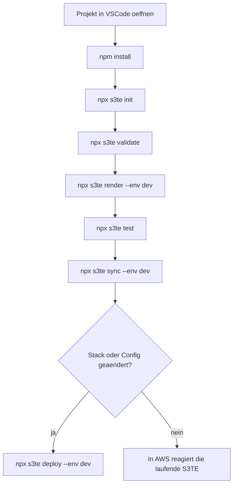

# S3TemplateEngine Rewrite - Lokale Entwicklung und VSCode

## Ziel

Dieses Dokument beschreibt den lokalen Entwicklungsworkflow fuer S3TE-Projekte. Es ist die Referenz fuer README, CLI-Design und spaetere Projekt-Scaffolds.

## Voraussetzungen

Pflicht:

- Node.js 20 oder neuer
- npm, passend zur installierten Node-Version
- Git

Empfohlen:

- Visual Studio Code
- AWS CLI v2

## Referenzpfad fuer AWS-Anmeldung im README

Der referenzierte Einsteigerpfad fuer die README ist:

1. AWS Konto erstellen
2. nicht mit dem Root-User weiterarbeiten
3. IAM Benutzer fuer taegliche Arbeit anlegen
4. AWS CLI v2 lokal installieren
5. `aws configure` mit Access Key und Secret Key ausfuehren

Die CLI selbst nutzt weiterhin die normale AWS Credential Chain und darf daher auch mit anderen Verfahren wie AWS SSO, Environment Variablen oder benannten Profilen verwendet werden.

## Verteilungsmodell

- Die CLI wird als npm-Paket `@projectdochelp/s3te` ausgeliefert.
- Das Binary heisst `s3te`.
- Das Testkit ist als Subpath-Export `@projectdochelp/s3te/testkit` verfuegbar.
- die Publish-Details fuer Maintainer stehen in [publishing.md](./publishing.md)

Unterstuetzte Installationsarten:

1. lokal im Projekt als Dev Dependency
2. global, optional nach einem echten npm-Publish der CLI

## Referenzinstallation lokal im Projekt

```bash
npm install --save-dev @projectdochelp/s3te
```

Aufruf:

```bash
npx s3te validate
```

## Optionale globale Installation

```bash
npm install --global @projectdochelp/s3te
```

Aufruf:

```bash
s3te validate
```

Hinweis:

- diese Installationsart ist nur ein Komfortpfad fuer Maintainer oder Power-User
- fuer normale Projektarbeit bleibt die projektlokale Installation mit `--save-dev` der Referenzweg
- diese Installationsart setzt voraus, dass `@projectdochelp/s3te` bereits in einer Registry wie npm veroeffentlicht wurde

## Maintainer-Workflow fuer npm

Wenn dieses Repository selbst weiterentwickelt und danach auf npm veroeffentlicht wird:

1. im Repo-Root `npm install` ausfuehren
2. `npm run pack:check` ausfuehren
3. `npm test` ausfuehren
4. das Root-Paket gemaess [publishing.md](./publishing.md) publishen

## `s3te init`

Der Befehl:

```bash
s3te init
```

`s3te init` darf gefahrlos mehrfach im selben Projekt laufen. Wenn `npm install` bereits eine `package.json` erzeugt hat, ergaenzt `s3te init` sie um fehlende S3TE-Defaults, eine vorhandene `s3te.config.json` wird um fehlende Scaffold-Werte ergaenzt, die von S3TE erzeugte Schema-Datei wird auf die aktuelle Paketversion aktualisiert, `--base-url` wird auf einen Hostnamen normalisiert, und bestehende Scaffold-Dateien bleiben ohne `--force` unveraendert.

erzeugt mindestens diese Struktur:

```text
project/
  package.json
  s3te.config.json
  .github/
    workflows/
      s3te-sync.yml
  app/
    part/
    website/
  offline/
    content/
    schemas/
    tests/
  .vscode/
    extensions.json
```

Die scaffoldete GitHub-Action ist der Referenzpfad fuer Teams, die Quellaenderungen nicht lokal mit `s3te sync`, sondern ueber Pushes in ein Repository in die Code-Buckets publizieren wollen.

Optional kann `s3te init` zusaetzlich erzeugen:

- Beispielseiten
- Beispiel-Partials
- Beispieltests
- `.gitignore`
- `.editorconfig`

## VSCode-Workflow

### Projekt in VSCode oeffnen

1. Repository oder Projektordner in VSCode oeffnen.
2. Die von `.vscode/extensions.json` empfohlenen Extensions installieren.
3. Das integrierte Terminal fuer `s3te`-Befehle verwenden.

### Empfohlene Extensions

- `redhat.vscode-yaml`
- `amazonwebservices.aws-toolkit-vscode`

### Referenzablauf in VSCode



## CLI-Referenz fuer lokale Entwicklung

### `s3te init`

- scaffoldet ein neues Projekt
- erzeugt Mindeststruktur und Beispielkonfiguration

### `s3te validate`

- validiert `s3te.config.json`
- validiert Template-Syntax
- validiert ungueltige `dbmultifileitem`-Kombinationen

### `s3te render`

- rendert lokal ohne AWS
- unterstuetzt mindestens `--env`
- optional `--variant`
- optional `--lang`
- optional `--entry`

### `s3te test`

- fuehrt projektbezogene Tests aus
- bindet das interne Testkit aus `@projectdochelp/s3te/testkit` ein
- nutzt in der Referenzimplementierung den Node Built-in Test Runner

### `s3te package`

- erstellt deterministische Deployment-Artefakte

### `s3te sync`

- synchronisiert aktuelle Projektquellen in die Code-Buckets einer bestehenden AWS-Umgebung
- verwendet `aws s3 sync --delete`, damit geloeschte Quellen Remove-Events ausloesen
- ist der normale Publish-Schritt fuer Template-, Part- und Asset-Aenderungen

### `s3te deploy`

- deployt in die angegebene AWS-Umgebung
- verwendet die AWS Credential Chain oder den uebergebenen AWS-Profile-Kontext
- installiert oder aktualisiert die AWS-Infrastruktur
- synchronisiert anschliessend ebenfalls die aktuellen Projektquellen in die konfigurierten Code-Buckets

### `s3te doctor`

- prueft Projektstruktur, Konfiguration und lokale Voraussetzungen
- meldet haeufige Fehlerbilder vor Render oder Deploy

### `s3te migrate`

- aktualisiert Projektdateien und Beispielkonfiguration auf den aktuellen S3TE-Stand
- darf Migrationshinweise und manuelle Nacharbeiten ausgeben

## Projektannahmen fuer README und Scaffolds

- Der primaere Beispiel-Workflow nutzt `npm` und `npx`.
- VSCode ist der referenzierte Editor-Workflow, aber nicht zwingend.
- AWS Deployments werden ueber die CLI angestossen, nicht ueber manuelles Editieren von Lambda-Umgebungsvariablen.
- Die Referenzimplementierung basiert intern auf JavaScript, ESM und einem buildfreien Laufzeitmodell.
