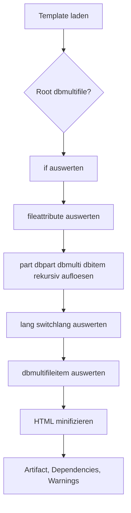

# S3TemplateEngine Rewrite - Template-Sprache

## Ziel

Dieses Dokument definiert die verbindliche Semantik der S3TE-Template-Sprache fuer V1. Der Rewrite muss mindestens diese Sprache implementieren.

Die Sprache ist absichtlich klein:

- HTML bleibt das Primaerformat
- S3TE-Tags sind einfache, literal geschriebene Markup-Tags
- es gibt keine Custom-Attribute, keine Expressionsprache und keine JavaScript-Einbettung

## Allgemeine Regeln

1. Templates sind UTF-8 Textdateien.
2. Renderbare Dateien sind standardmaessig `.html`, `.htm` und `.part`.
3. S3TE-Tags sind case-sensitive und immer lowercase geschrieben.
4. S3TE-Tags verwenden keine HTML-Attribute.
5. JSON-Payloads muessen valides JSON sein.
6. Unbekannte JSON-Properties in S3TE-Kommandos sind ungueltig.
7. Fehlende Includes, Sprachinhalte oder Content-Referenzen werden als leerer String gerendert und als Warnung protokolliert.
8. Zyklen in `part`-Includes oder rekursiven Fragmenten sind Build-Fehler.
9. Die Rekursion ist auf `maxRenderDepth` aus der Konfiguration begrenzt.



## Lexikalische Regeln

### Erkennung von S3TE-Tags

Ein S3TE-Tag besteht immer aus:

- einem Oeffnungstag wie `<part>`
- einem Schliessungstag wie `</part>`
- einem Payload zwischen diesen Tags

Unterstuetzte Tags in V1:

- `part`
- `if`
- `fileattribute`
- `lang`
- `switchlang`
- `dbpart`
- `dbmulti`
- `dbmultifile`
- `dbitem`
- `dbmultifileitem`

### Whitespace-Regeln

Fuer einfache Text-Payloads wird der Inhalt vor der Auswertung getrimmt:

- `part`
- `fileattribute`
- `lang`
- `dbpart`
- `dbitem`
- `dbmultifileitem` im String-Modus

Fuer JSON-Kommandos wird vor `JSON.parse` ebenfalls getrimmt.

Bei `switchlang` bleibt der Inhalt des gewaehlten Sprachblocks unveraendert erhalten.

### Schachtelung

Erlaubt:

- unterschiedliche S3TE-Tags ineinander
- S3TE-Tags innerhalb der von `part`, `dbpart`, `dbmulti` oder `switchlang` gelieferten Fragmente

Nicht erlaubt:

- dieselbe JSON-basierte Tag-Art direkt in sich selbst verschachtelt, wenn dadurch kein eindeutiger literal ermittelbarer End-Tag mehr existiert

Konsequenz fuer die Implementierung:

- die Parserlogik darf literal- und stringbasiert arbeiten
- ein vollstaendiger HTML-Parser ist fuer V1 nicht erforderlich

## Render-Kontext

Jeder Render-Lauf besitzt einen Kontext mit mindestens:

- `environment`
- `variant`
- `language`
- `sourceKey`
- `outputKey`
- optional `currentContentItem`
- `TemplateRepository`
- `ContentRepository`
- `DependencyStore`

## Fehler- und Warnungsvertrag

### Warnungen

Warnungen unterbrechen den Build nicht.

Pflichtwarnungen:

- `MISSING_PART`
- `MISSING_CONTENT`
- `MISSING_LANGUAGE`
- `UNSUPPORTED_CONTENT_NODE`
- `INVALID_HTML_TRUNCATION_RECOVERED`

### Build-Fehler

Pflicht-Build-Fehler:

- ungueltiges JSON in einem Tag
- unbekannte JSON-Properties in einem Tag
- Include-Zyklus
- Ueberschreiten von `maxRenderDepth`
- ungueltige `dbmultifile`-Konfiguration
- ungueltige `dbmultifileitem`-Konfiguration
- ungueltiger oder doppelter generierter Dateiname

## Tag-Semantik

## `part`

Zweck:

- laedt ein wiederverwendbares Fragment aus `partDir`

Syntax:

```html
<part>head.part</part>
```

Payload:

- ein relativer Dateiname oder relativer Pfad unterhalb von `partDir`

Regeln:

1. der Payload wird getrimmt
2. fuehrende `/` sind ungueltig
3. `..` ist ungueltig
4. Pfadtrenner werden intern auf `/` normalisiert
5. der Inhalt wird als Template-Fragment rekursiv weiterverarbeitet
6. eine Verwendung erzeugt eine Dependency vom Typ `partial`

Fehlt die Datei:

- Ergebnis: leerer String
- Warnung: `MISSING_PART`

## `if`

Zweck:

- rendert ein Inline-Template nur dann, wenn alle Bedingungen erfuellt sind

Syntax:

```html
<if>{
  "env": "prod",
  "file": "index.html",
  "not": false,
  "template": "<meta name='robots' content='all'>"
}</if>
```

Erlaubte JSON-Properties:

- `env?: string`
- `file?: string`
- `not?: boolean`
- `template: string`

Regeln:

1. mindestens eine Bedingung aus `env` oder `file` darf gesetzt sein, beide sind optional
2. `template` ist Pflicht
3. mehrere gesetzte Bedingungen werden mit `AND` verknuepft
4. `env` wird case-insensitive gegen den Render-Kontext verglichen
5. `file` wird gegen `outputKey` verglichen
6. wenn `not = true`, wird das Gesamtergebnis invertiert
7. der gerenderte `template`-String wird anschliessend selbst wieder als Fragment verarbeitet

## `fileattribute`

Zweck:

- gibt Dateimetadaten des aktuellen Outputs aus

Syntax:

```html
<fileattribute>filename</fileattribute>
```

Pflichtattribute in V1:

- `filename`

Rueckgabewert:

- `outputKey` relativ zum Ziel-Bucket

Unbekannte Attribute:

- Ergebnis: leerer String
- Warnung: `UNSUPPORTED_TAG`

## `lang`

Zweck:

- gibt sprachspezifische Metadaten des aktuellen Render-Ziels aus

Syntax:

```html
<lang>2</lang>
<lang>baseurl</lang>
```

Pflichtkommandos in V1:

- `2`: aktueller Sprachcode
- `baseurl`: `variants.<variant>.languages.<lang>.baseUrl`

Unbekannte Kommandos:

- Ergebnis: leerer String
- Warnung: `UNSUPPORTED_TAG`

## `switchlang`

Zweck:

- waehlt Inline-Content fuer die aktuelle Sprache

Syntax:

```html
<switchlang>
  <de>Hallo</de>
  <en>Hello</en>
</switchlang>
```

Regeln:

1. direkte Kinder von `switchlang` sind Sprachelemente wie `<de>...</de>`
2. der Tagname muss exakt dem Sprachcode entsprechen
3. nur der Block der aktuellen Sprache wird uebernommen
4. sein Inhalt wird als Template-Fragment weiterverarbeitet
5. es gibt keinen Fallback auf `defaultLanguage`

Fehlt der Sprachblock:

- Ergebnis: leerer String
- Warnung: `MISSING_LANGUAGE`

## `dbpart`

Zweck:

- laedt genau ein Content-Fragment aus dem `ContentRepository`

Syntax:

```html
<dbpart>impressum</dbpart>
```

Payload:

- `contentId` als String

Sprachregel:

1. wenn das Content-Item ein Feld `content<lang>` besitzt, wird dieses verwendet
2. sonst wird `content` verwendet
3. fehlt beides, wird leer gerendert

Regeln:

1. eine Verwendung erzeugt eine Dependency vom Typ `content`
2. der geladene Content wird als Template-Fragment weiterverarbeitet

Fehlt das Item oder das Content-Feld:

- Ergebnis: leerer String
- Warnung: `MISSING_CONTENT`

## `dbmulti`

Zweck:

- rendert ein Inline-Template fuer alle passenden Content-Items

Syntax:

```html
<dbmulti>{
  "filter": [
    {"forWebsite": {"BOOL": true}}
  ],
  "filtertype": "contains",
  "limit": 3,
  "template": "<article><h2><dbitem>headline</dbitem></h2></article>"
}</dbmulti>
```

Erlaubte JSON-Properties:

- `filter: LegacyFilterClause[]`
- `filtertype?: "equals" | "contains"`
- `limit?: number`
- `template: string`

Regeln:

1. `filter` ist Pflicht
2. `template` ist Pflicht
3. mehrere Filterklauseln werden logisch mit `AND` verknuepft
4. `filtertype` Standard ist `equals`
5. `limit` ist optional
6. `limit <= 0` bedeutet leeres Ergebnis
7. das `template` wird fuer jedes gefundene Item mit `currentContentItem` gerendert

### Filter-Semantik

Die Filter-Syntax bleibt bewusst nahe an DynamoDB:

```json
{"headline": {"S": "Hello"}}
{"forWebsite": {"BOOL": true}}
{"order": {"N": 3}}
{"tags": {"S": "news"}}
```

Regeln:

1. genau ein logisches Feld pro Klausel
2. erlaubte Werte:
   - `S`
   - `N`
   - `BOOL`
   - `NULL`
   - `L`
3. `filtertype = "equals"` bedeutet typgenaue Gleichheit
4. `filtertype = "contains"` bedeutet:
   - bei Listen: Element enthalten
   - bei Strings: Substring enthalten
5. das logische Feld `__typename` wird auf das Modell des Content-Items gemappt

### Ergebnisreihenfolge

Die Reihenfolge ist deterministisch:

1. Items mit numerischem Feld `order` zuerst, aufsteigend
2. bei gleichem `order`: `contentId` lexikografisch, dann `id`
3. Items ohne numerisches `order` danach, ebenfalls `contentId`, dann `id`

### Dependencies

`dbmulti` erzeugt fuer jedes verwendete Item eine Dependency vom Typ `content`.

## `dbmultifile`

Zweck:

- erzeugt aus einem Template mehrere Output-Dateien, je eine pro Content-Item

Syntax:

```html
<dbmultifile>{
  "filenamesuffix": "id",
  "filter": [
    {"__typename": {"S": "article"}}
  ]
}</dbmultifile>
<!doctype html>
<html>
  <body><dbmultifileitem>headline</dbmultifileitem></body>
</html>
```

Erlaubte JSON-Properties:

- `filenamesuffix: string`
- `filter: LegacyFilterClause[]`
- `filtertype?: "equals" | "contains"`
- `limit?: number`

Regeln:

1. `dbmultifile` muss das erste nicht-leere Konstrukt des Templates sein
2. vorangestellte Whitespace-Zeichen sind erlaubt
3. der Kontrollblock selbst wird nicht ausgegeben
4. der restliche Template-Inhalt nach `</dbmultifile>` ist die Body-Vorlage
5. fuer jedes gefundene Item wird genau ein Output erzeugt
6. alle bisher aus dieser Vorlage erzeugten Outputs, die im neuen Ergebnis fehlen, muessen geloescht werden

### Dateinamensbildung

Der neue Dateiname lautet:

- `<basename>-<suffix>.<ext>`

Beispiel:

- Quelle `article.html`
- Suffix `123`
- Ergebnis `article-123.html`

Regeln fuer den Suffix-Wert:

1. das Feld wird als String serialisiert
2. der String wird getrimmt
3. leerer String ist ungueltig
4. `/`, `\`, Steuerzeichen und `:` sind ungueltig
5. Suffixe muessen innerhalb desselben Templates eindeutig sein

`limit` wirkt hier auf die Anzahl generierter Dateien, nicht auf Textlaenge.

## `dbitem`

Zweck:

- greift innerhalb von `dbmulti` oder `dbmultifile` auf ein Feld des aktuellen Content-Items zu

Syntax:

```html
<dbitem>headline</dbitem>
```

Regeln:

1. der Payload benennt ein logisches Feld
2. `__typename` mappt auf das Modell
3. `_version` mappt auf die Version
4. `_lastChangedAt` mappt auf den letzten Aenderungszeitpunkt

Serialisierung:

- `string` -> direkt ausgeben
- `number` -> direkt ausgeben
- `boolean` -> `true` oder `false`
- `string[]` -> als hintereinanderhaengende HTML-Links serialisieren
- `null` oder fehlend -> leerer String plus Warnung

Link-Serialisierung fuer `string[]`:

1. jedes Element wird zu `<a href='URL'>TEXT</a>`
2. `TEXT` ist der Teil nach dem letzten `-`
3. wenn kein `-` enthalten ist, ist `TEXT` die volle URL
4. zwischen Links wird kein Trennzeichen eingefuegt

## `dbmultifileitem`

Zweck:

- wendet erweiterte Transformationen auf das aktuelle Item innerhalb eines `dbmultifile`-Bodies an

Erlaubte Modi:

1. einfacher Feldzugriff als String-Payload
2. JSON-Kommandos fuer Begrenzung, Datumsformatierung oder Segmentextraktion

### Einfache Feldausgabe

```html
<dbmultifileitem>headline</dbmultifileitem>
```

Dieser Modus verwendet dieselbe Feldauflosung und Serialisierung wie `dbitem`.

### Begrenzung

```html
<dbmultifileitem>{"field":"content","limit":160}</dbmultifileitem>
```

Erlaubte JSON-Properties in diesem Modus:

- `field`
- `limit`
- optional `limitlow`

Regeln:

1. `field` ist Pflicht
2. `limit` ist Pflicht
3. `limit` und `limitlow` muessen ganze Zahlen >= 0 sein
4. `limitlow` darf nur zusammen mit `limit` vorkommen
5. `limitlow` darf nicht groesser als `limit` sein
6. es wird auf Unicode-Zeichen, nicht auf Bytes, begrenzt
7. wenn abgeschnitten wird, wird `...` angehaengt
8. danach wird das HTML-Fragment repariert, damit offene Tags geschlossen sind

### Begrenzte Nicht-Deterministik

```html
<dbmultifileitem>{"field":"content","limitlow":120,"limit":160}</dbmultifileitem>
```

Dies ist die einzige erlaubte Nicht-Deterministik im gesamten Rendering.

Regeln:

1. die Engine waehlt pro Tagvorkommen und Render-Lauf genau eine ganze Zahl im inklusiven Bereich `limitlow..limit`
2. die Verteilung soll gleichmaessig sein
3. wenn `limit = 0` oder `limit >= textLaenge`, wird der Originaltext unveraendert zurueckgegeben
4. die Nicht-Deterministik betrifft nur die konkrete Grenzlaenge, nicht die restliche Render-Reihenfolge

### Datumsformatierung

```html
<dbmultifileitem>{"field":"publishedAt","format":"date","locale":"de"}</dbmultifileitem>
```

Regeln:

1. `field` ist Pflicht
2. `format` muss `date` sein
3. Werte < `1000000000000` werden als Unix-Sekunden interpretiert
4. Werte >= `1000000000000` werden als Unix-Millis interpretiert
5. `locale = "de"` ergibt `dd.mm.yyyy`
6. jede andere Locale ergibt `mm/dd/yyyy`

### Ausschnitt zwischen Marker-Tags

```html
<dbmultifileitem>{
  "field":"content",
  "divideattag":"<h2>",
  "startnumber":2,
  "endnumber":3
}</dbmultifileitem>
```

Regeln:

1. `field` ist Pflicht
2. `divideattag` ist Pflicht
3. `startnumber` und `endnumber` sind 1-basierte Vorkommnisnummern
4. fehlt `startnumber`, beginnt der Ausschnitt am Stringanfang
5. fehlt `endnumber`, endet der Ausschnitt am Stringende
6. ist `startnumber` groesser als die Anzahl der Vorkommnisse, ist das Ergebnis leer und es wird gewarnt
7. ist `endnumber` groesser als die Anzahl der Vorkommnisse, endet der Ausschnitt am Stringende

### Validierungsregeln fuer JSON-Kommandos

1. genau ein Transformationsmodus pro Kommando
2. `field` ist fuer JSON-Kommandos immer Pflicht
3. unbekannte Properties sind ungueltig
4. `limitlow` ohne `limit` ist ungueltig
5. `limitlow > limit` ist ungueltig
6. `startnumber` und `endnumber` muessen ganze Zahlen >= 1 sein

## Rekursion und Dependencies

### Rekursive Aufloesung

Die Implementierung muss rekursiv arbeiten, aber zyklensicher bleiben.

Pflichtverhalten:

1. `part`, `dbpart`, `dbmulti` und `switchlang` koennen neue S3TE-Tags in ihren Fragmenten einfuehren
2. diese Fragmente muessen erneut durch die Pipeline laufen
3. die Tiefe darf `maxRenderDepth` nicht ueberschreiten
4. der Include-Stack fuer `part` muss auf Zyklen geprueft werden

### Dependency-Erfassung

Es muessen mindestens diese Dependencies gesammelt werden:

- `partial#<partPath>`
- `content#<contentId>`
- `generated-template#<templateKey>`

## HTML-Minifizierung

Die V1-Minifizierung bleibt bewusst konservativ und nah am Legacy-Verhalten.

Schritte:

1. HTML-Kommentare entfernen
2. CSS-Kommentare innerhalb von `<style>` entfernen
3. JS-Kommentare innerhalb von `<script>` entfernen
4. wiederholte Whitespaces ausserhalb geschuetzter Bereiche reduzieren

Geschuetzte Bereiche:

- `pre`
- `textarea`

Regeln:

1. der Minifier darf die Semantik des Dokuments nicht veraendern
2. Inline-Script und Inline-Style bleiben ansonsten textuell erhalten
3. die Zielimplementierung darf spaeter einen robusteren Minifier verwenden, wenn die Ergebnisse kompatibel bleiben

## HTML-Reparatur nach Begrenzung

Bei `dbmultifileitem` mit Begrenzung muss die Implementierung:

1. einen abgeschnittenen, unvollstaendigen End-Tag am Stringende entfernen
2. verbleibende offene Nicht-Void-Tags schliessen
3. bei noetiger Reparatur optional eine Warnung `INVALID_HTML_TRUNCATION_RECOVERED` erzeugen

Void-Elemente wie `br`, `img`, `hr`, `meta`, `link`, `input` werden nicht geschlossen.

## Beispiel

```html
<!doctype html>
<html lang="<lang>2</lang>">
  <head>
    <part>head.part</part>
    <if>{
      "env": "prod",
      "template": "<meta name='robots' content='all'>"
    }</if>
  </head>
  <body>
    <switchlang>
      <de>Willkommen</de>
      <en>Welcome</en>
    </switchlang>
    <dbmulti>{
      "filter": [{"forWebsite": {"BOOL": true}}],
      "template": "<article><h2><dbitem>headline</dbitem></h2></article>"
    }</dbmulti>
  </body>
</html>
```

## Bewusste Abweichungen vom Legacy-Code

Diese Punkte werden fuer V1 absichtlich sauberer definiert als im alten Lambda:

1. `dbmulti` und `dbmultifile` sortieren deterministisch, nicht nach zufaelliger Scan-Reihenfolge
2. `dbmultifileitem.limitlow` verwendet inklusive ganzzahlige Grenzen statt impliziter Float-Arithmetik
3. `dbmultifile` erlaubt fuehrendes Whitespace vor dem Kontrollblock
4. Zyklen werden als Build-Fehler erkannt statt in undefiniertem Verhalten zu enden
